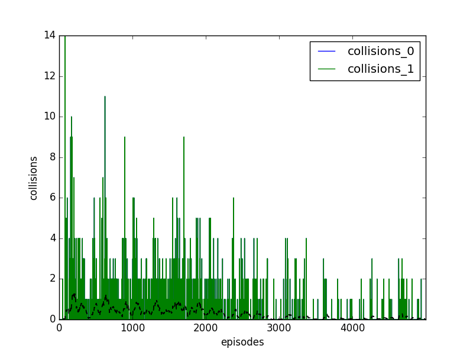

# 10707-deep-learning-project
Deep Learning Course Project

This repository contains our implementation of DQN, DDPG, and MADDPG that works on a slightly modified version of the predator-pray environment. It also contains our results, including trained weights and training rewards and losses.

Here is a summary of the folders:
* `multiagent-particle-envs/`: This folder contains our implementation of DQN, DDPG, and MADDPG agents (`dqn.py`, `ddpg.py`, `maddpg.py`). It also contains the main file used for training and testing the agents (`dqn_tag.py`, `ddpg_tag.py`, `maddpg_tag.py`).
* `multiagent-particle-envs/multiagent/scenarios/`: This folder contains the modified version of the predator-pray scenario (`simple_tag_guided_1v1.py`, `simple_tag_guided_1v2.py`, `simple_tag_guided_2v1.py`).
* `report/`: This folder contains the latex files for our final report.
* `results/`: This folder contains the trained weights of our DQN, DDPG, and MADDPG models, and the statistics collected during training.

Some Results:
|  |  |  |
